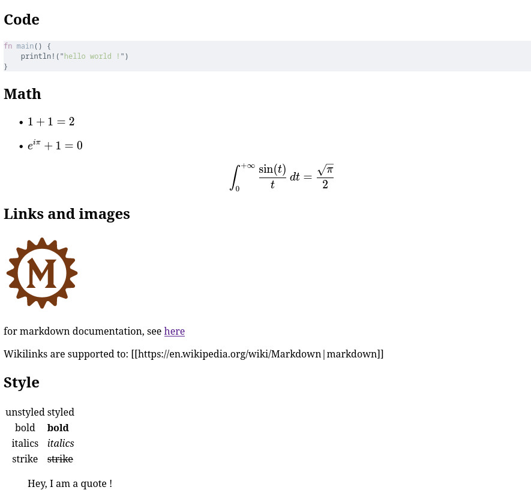

# Goal
A simple library to render markdown with dioxus, at runtime.
The best rust crates are involved !

# Usage
Add dioxus-markdown to your project:
```toml
# Cargo.toml
yew-markdown = {git="https://github.com/rambip/dioxus-markdown"}
```

If you just need to render basic markdown, you can do

```rust
use dioxus_markdown::Markdown;
...
    rsx!{
        Markdown {src:"# Mardown power !"}
    }
```

# Examples
Take a look at the different examples !
You just need trunk and a web-browser to test them.

## Showcase
the example is included in `./examples/showcase`

Here is an illustration:


see [here](https://rambip.github.io/dioxus-markdown/showcase)

## Interactivity
see [here](https://rambip.github.io/dioxus-markdown/onclick)

